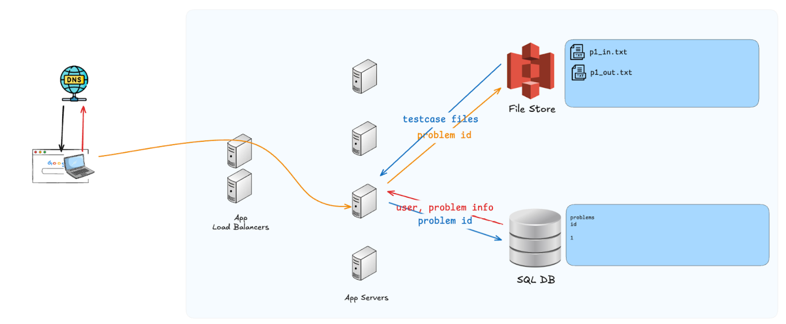
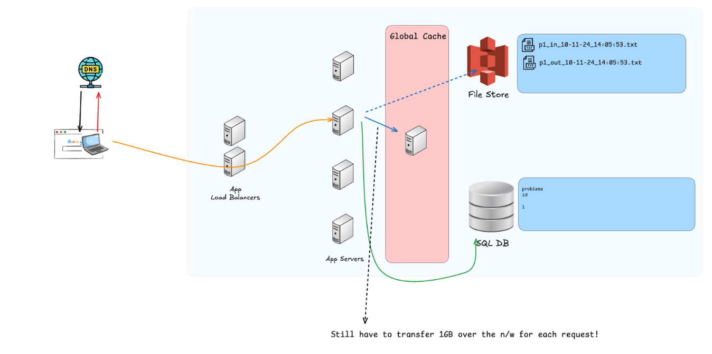
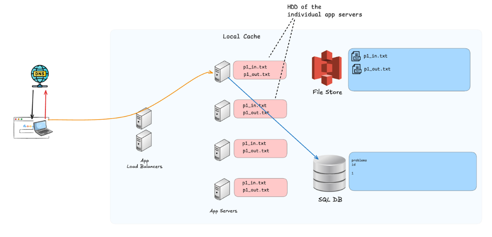
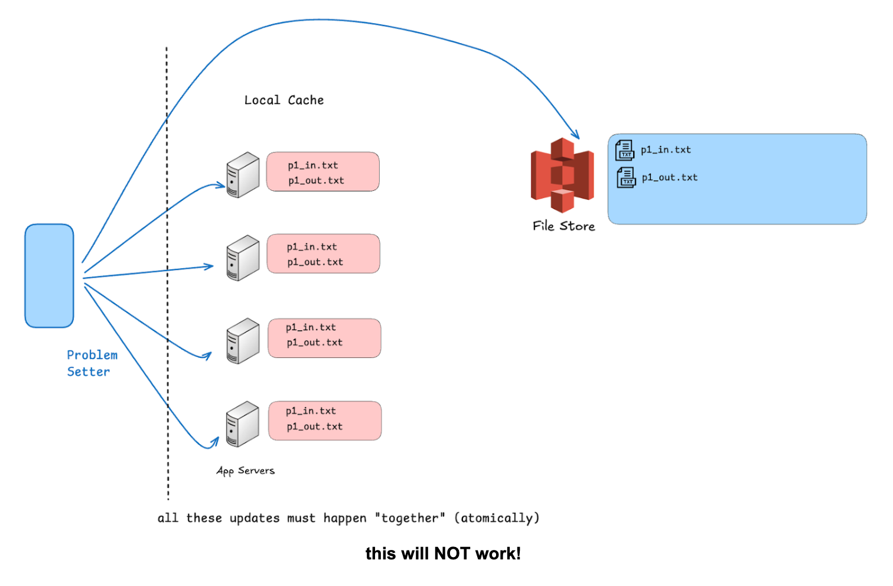
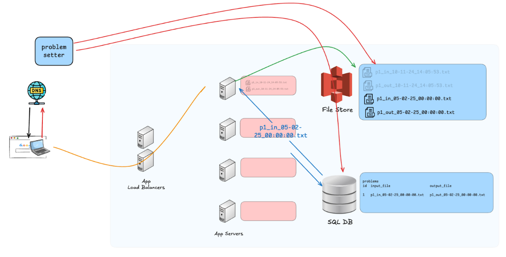
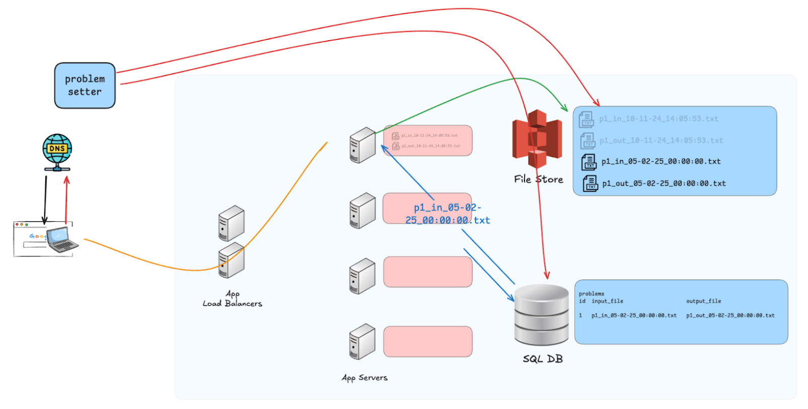
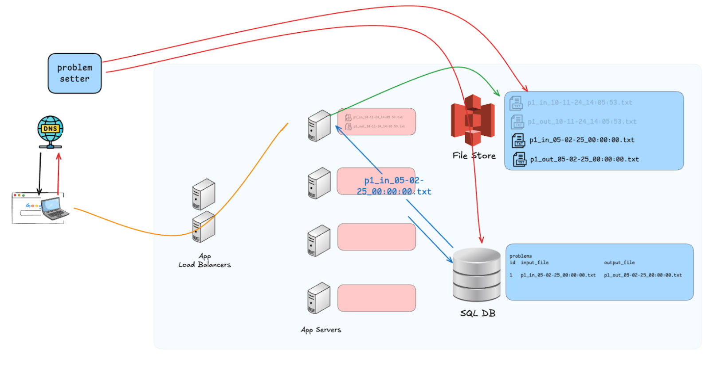

#Code Judge

Code Judge - service that "judges" your code submission. When you submit a solution for a DSA problem in any platform like Scaler, Leetcode, Codechef, GFG and many more. They have to take our code and run it through hundreds of testcases to evaluate whether it is correct or not.

We will be understanding through Scaler example.

## Situation
### Q: What does the appserver need to evaluate a code submission?
1. User info (auth, already solved this problem or not, part of course or not, ..) 
2. Problem info (topic, total score, memory limit, time limit, number of testcases, ..) 
3. Testcase data (input file, expected output file)

### Q: How large can this data be (in the avg/worst case)?
User info / Problem info - a few KBs **(SQL database - Amazon RDS)**  
Testcase data - 1 to 2 GBs **(File storage - Amazon S3)**

For a problem we run your code through 100 testcases.   
Imagine that the problem is about sorting the array.  
Each testcase comprises of a large array (N = 10^6).  
Each expected output for each testcases is also a large array (N = 10^6)

```
100 testcases * (10^6 integers / testcase) * (8 bytes / integer)
= 100 * 10^6 * 8 bytes
= 800 MB
~ 1 GB
```
This is for the input file. similar size for the output file.


### Q: What is the total size of testcase data in S3?    
Scaler has around 3, 000 problems   
so around **3000 problem * (1GB testcase data / problem)**  
**= 3TB** of testcase data

Is this data too large?  
Not really - storage is cheap.  
3TB is too large to fit completely in RAM. But can easily fit on HDD.

### **Q: How many problems are being solved on any given day?**  
Around 100 200 different problems are being solved by the Scaler students on any given day. We're running multiple batches in parallel. Each batch might be solving the problems of the current (or last) class. The batches also overlap in timelines.



### **Q: Should we store these testcases in a CDN?**  
No! Backend services will never access data from the CDN  
1. CDNs are client facing. 
2. CDNS reduce latency for the client, by serving the data from an (edge) server close to the user. 

### Need for caching
**Q: Do we want to transfer 1GB of data over the network for each request?**  
Absolutely No.  
Therefore, we need a cache!  

Local vs Global
• Global Cache: doesn't really solve our problem
- yes, it will be available to all app servers (so our app servers can be stateless)
- yes, the data is large, so global makes more sense?
- NO - it doesn't solve our problem at all - we still have to transfer 1GB of testcase data for each request - from the cache server to the app server
• earlier we were transferring from S3 to app server - expensive!
• now we're transferring from cache to app server - expensive!




Local Cache: each server caches some testcases in the local HDD
- the request will come to the app server
- the app server will hit the SQL db to fetch the user/problem info (small data)
- if the problem's testcases are already cached in the appserver's HDD, it will just use those testcase files (no n/w overhead)
- if not cached, it will download the files from S3, and cache it locally (on its HDD), and then use it
- any subsequent requests for the same problem will now use the testcases from the HDD 




POST /evaluate-submission

```
fn check_solution (request):
    pid = request.solution.problem_id
    uid = request.auth_token.uid
    user_info, problem_info = fetch_from_SQL (user_id, pid)

    if not file_exists(`{pid}_in.txt`):    // caching logic 
        download_from_s3([`{pid}_in.txt`, `{pid}_out.txt`]) 
        // this function will save it on the local HDD
        
    inputs = read_file(`{pid}_in.txt') // these reads are from the local HDD
    expected_outputs = read_file(`{pid}_out.txt`)

    return evaluate (solution.code, inputs, expected_outputs)
```

### Single vs Distributed    
N/A - single vs distributed only applies for global caches
Local cache is distributed automatically, because there are multiple app server


### Invalidation Algorithm
**When is invalidation applicable?**  
if the data never changes, do we need to invalidate?
Invalidation is only applicable when the data changes.

**Q: Can the testcases change?**  
New problems can be added but that is not a data updation.  

Can the testcase data for an existing problem be updated?  
Yes.  
Because our problem setters are not Gods. they can make mistakes.  
It is possible that
• our editorial solution was incorrect
- we've to fix the solution and the expected_output.txt file
• our solution was correct, but our testcases were not "tight enough"
- our problem required a O(n log n) solution, but the testcases let the  O(n2) solutions pass as well.  
- so we've to fix both the input.txt and the
expected_output.txt file

**Q: How frequently will the testcases change?**   
Extremely rarely. We have good problem setters, and a lot of quality assurance to ensure that bad problems are not created. But it happens from time to time.

Let's say for a given problem we might want to update the testcases once a year on average.  
1 update / problem / year on average


**Q: Do we really need to worry about this edgecase?**
Can we just ignore this, since it is a rare edgecase? Absolutely NOT!  
We must have the infrastructure & logic in place!  
Imagine that we realize that our testcases are bad during a live contest. we can't say stuff like “oh but I thought that this will be so rare, my cat also thinks the same, so I didn't implement this..."  
So we need to have an invalidation algorithm in place.  
We know that different invalidation techniques give us different consistency guarantees.  

## Q: What consistency do we require?
**Q: Is eventual consistency good enough, or do we require immediate consistency?**
**Q: What does eventual consistency mean in this context? What does it mean to have a stale read?**

Imagine that during a contest, we realise that some testcases are wrong. Our problem setters will create new testcases, and upload them to S3. And we announce to all contest participants that the testcases have been updated, please resubmit problem 3.

**Eventual Consistency:** after updation & announcement, for sometime (next 10 mins) when people resubmit P3, still, the old testcases are used. **NOT good enough!**   
**Immediate Consistency:** after updation & announcement, any submissions to P3 use the new testcases (guaranteed!)

So now that we know that we require immediate consistency, it is obvious that we should use Write Through.

But, let's explore - just for learning

### TTL
Every time we download the file from S3, we maintain an expiry time. If the request comes before expiry, we will use these cached testcases, otherwise, we will assume that the file has expired, we will delete the cached testcase, and fetch again from S3

```
fn check_solution (solution):
    pid solution [ 'problem_id']
    user_info, problem_info = fetch_from_rds (pid)

    if file_exists(`{pid}_in.txt`):
        if read_last_updated_at(`{pid}_in.txt`) < now() - (1 hour):
            // file was downloaded more than 1 hour ago stale!
            delete_file(`{pid}_in.txt') // TTL invalidation

    if not file_exists(`{pid}_in.txt'):   // caching logic
        download_from_s3 ( [`{pid}_in.txt`, `{pid}_out.txt`]) 
        // this function will save it on the local HDD

    inputs = read_file({pid}_in.txt')   // these reads are from the local HDD
    
    expected_outputs = read_file(`{pid}_out.txt`)
    return evaluate (solution.code, inputs, expected_outputs)
```

### What is the ideal TTL?
- 1 week?
- 1 day?
- 10 hours?
    by the time the TTL expires, the contest is over. The updated testcases never took effect
- 10 min?  
    for the next few minutes after your announcement, the old testcases are still being used. Bad user experience 
- 1 min?
- 10 seconds?
- 1 second?  
    every 1 min the TTL is expiring. After 1 min, each app server will have to re-download 5-10 GB files from S3.  
        if we've 1000 app servers for code judge, then we will be transferring 5TB of data per minute
    defeats the purpose of caching
        the miss rate is too high   

There should some sweet spot for TTL.

No! There's absolutely no sweet spot - none of the values are going to work. All of them are bad experience some way or another.

### Write Around
Same as TTL - we will have to decide how frequently the CRON job
will run.  
Once again, there's no ideal value. 

### Write Back
This is stupid - this will lead to data loss. Additionally, we've a local cache - we will have to write to 1000 app servers whenever a write
comes.

### Write Through Cache
**Q: it is feasible to update 1GB files in hundreds of app servers + S3 in an atomic manner?**
Absolutely not!  
Maintaining atomicity across 2 servers is already insanely hard & slow.  
Maintaining atomicity across 100s of servers is impossible
- at least 1 server will fail - you now have to rollback the other 99
servers
- you will be limited by the slowest server (incredibly slow writes)




Instead, we can do the following
1. we will version the testcase files using a timestamp in the file
name
p1_input.txt → p1_input_2025-03-16 08:00.txt
2. the normal cache works as earlier (with slight modification)
- when a request comes to the app server, we first check the SQL db to fetch the user info and problem info
- during this call itself, the SQL db will also give us the input/output file names for this problem's testcases
- if these files are already available in the HDD (local cache), then just use them
- if not, then fetch from S3 and then use them



3. **for invalidation**
- problem setter will upload the new files **(with new timestamp in name)** to S3
- problem setter will update the file name in SQL db 
    note that these two writes (S3, SQL) don't have to be atomic.
    we can first upload to S3, and only if that succeeds, we can update the filename in SQL 
    because if the new file is uploaded in S3, but filename is not updated in SQL, the new is not causing any harm - it's just not being used. 
- for any requests that come to the app server after the SQL entry has been updated
    the SQL db will provide the new file name
    app server will detect that it does not have these new files in the HDD (Local cache)
    so, the app server will fetch these files from S3 & then use them

```
fn check_solution (request):
    pid = request.solution.problem_id
    uid = request.uid
    user_info, problem_info = fetch_from_rds (uid, pid)

    input_file_name = problem_info.input_file_name //get the version from the SQL DB
    output_file_name = problem_info.output_file_name

    if not file_exists(`{file_name}_in.txt`):
    // caching logic
        download_from_s3 ([`{file_name}_in.txt`, `{file_name}_out.txt `]) // this function will save it on the local HDD

    inputs = read_file(`{file_name}_in.txt') // these reads are from the local HDD
    expected_outputs = read_file(`{file_name}_out.txt')
    return evaluate (solution.code, inputs, expected_outputs)
```



Basically, we're caching the testcases. 
we're not caching the version id - the version id is fetched everytime from the DB - so version id cannot be stale. 

Now that we're not updating the testcases at all (we're not modifying existing files, we're uploading a new version), the testcase are immutable - since they never change, there's not need for invalidation.  

# Eviction Algorithm  
## LRU eviction
Operating system will automatically maintain the read timestamps for all files. We can just use that for LRU eviction.
We can find all the files in the folder whichever file was least recently used, just delete that to make space.

```
fn check_solution (solution): 
    pid = solution['problem_id'] 
    user_info, problem_info = fetch_from_rds(pid)

    file_name = problem_info['file_name']  // get the version from the SQL DB
    if not file_exists(`{file_name}_in.txt`):  // caching logic
        if get_folder_size('.') > 100GB:    
            delete(get_oldest_accessed_at_file('.'))  // LRU eviction
        
        download_from_s3 ([`{file_name}_in.txt`, {file_name}_out.txt `])
        // this function will save it on the local HDD

    inputs = read_file(`{file_name}_in.txt`)  // these reads are from the local HDD

    expected_outputs = read_file({file_name}_out.txt')
    return evaluate (solution.code, inputs, expected_outputs)
```


## Load Balancer
The LB can just use **Round Robin**. Each app servers acts independently.

**Should we use consistent hashing?**



Round Robin
- any request can go to any app server
- All app servers will have to cache all 100 problems that are being solved on any given day.
- This seems like a waste (but is not).  

Consistent Hashing based on user id
- same thing
- because any user can be solving any problem, and multiple users will be assigned to any server,
- every server will have to cache all problems that are being solved today 

Consistent Hashing (based on problem id)
- any requests for Problem 1 goes to server 1
- any requests for Problem 2 goes to server 2,
...
- Now only server 1 has to cache the testcases for problem 1. 
 
But, routing based on problem_id is a bad design!
1. during a contest, 100k people are solving 5 problem 
2. out of the 100 app servers, only 5 are getting all the load - uneven load distribution
3. in our case, a single server can't even handle multiple requests at the same time
a. typically, to handle multiple requests at the same time - we use multi-threading


**Q: Is multi-threading a good idea in this case?**
NO! We can not multi-thread the code-judge!  
Code evaluation is a CPU bound task.

**Q: What does multi-threading do?**

Most programs are I/O bound. They're waiting for some I/O to happen (user keystroke / mouse click, network download, file read, printer access/...)

CPU are millions of times faster than disks / networks.  
99.99% of the time, your CPU is idle.  
So, you can do multiple things at the same time by "context switching" the CPU.  
Do task 1 - now that task 1 is waiting for some I/O - but instead of waiting, you context switch  
start doing task 2 - task 2 will also go for I/O - context switch back to task 1    
do task 1-...
...
CPU bound tasks (video processing, heavy computation, analytics, machine learning, sha calculation, ...)  
context switching will worsen the performance - because the CPU is already busy - if you try to break its loop and get it to multi-task it will slow everything down - thrashing   

**Moral: only multi-thread I/O bound processes. Never multi-thread CPU bound processes.**

In code judge, evaluating a single request requires ~5 seconds. During those 5 seconds the app server completely occupied - it cannot handle any other requests.  
**Therefore, we want requests to go to the next available server - Round Robin routing**